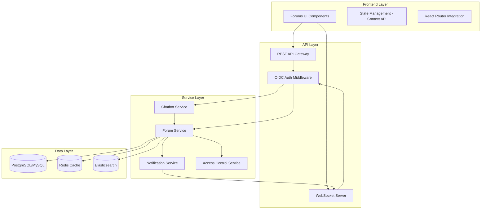
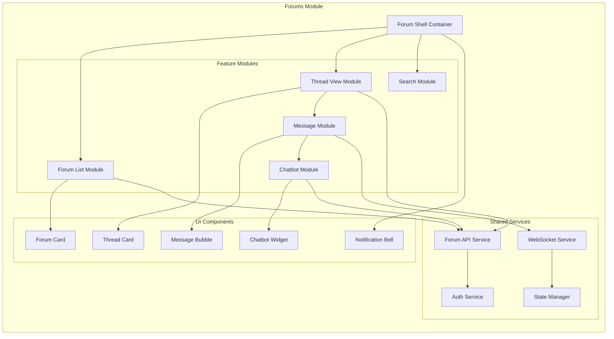
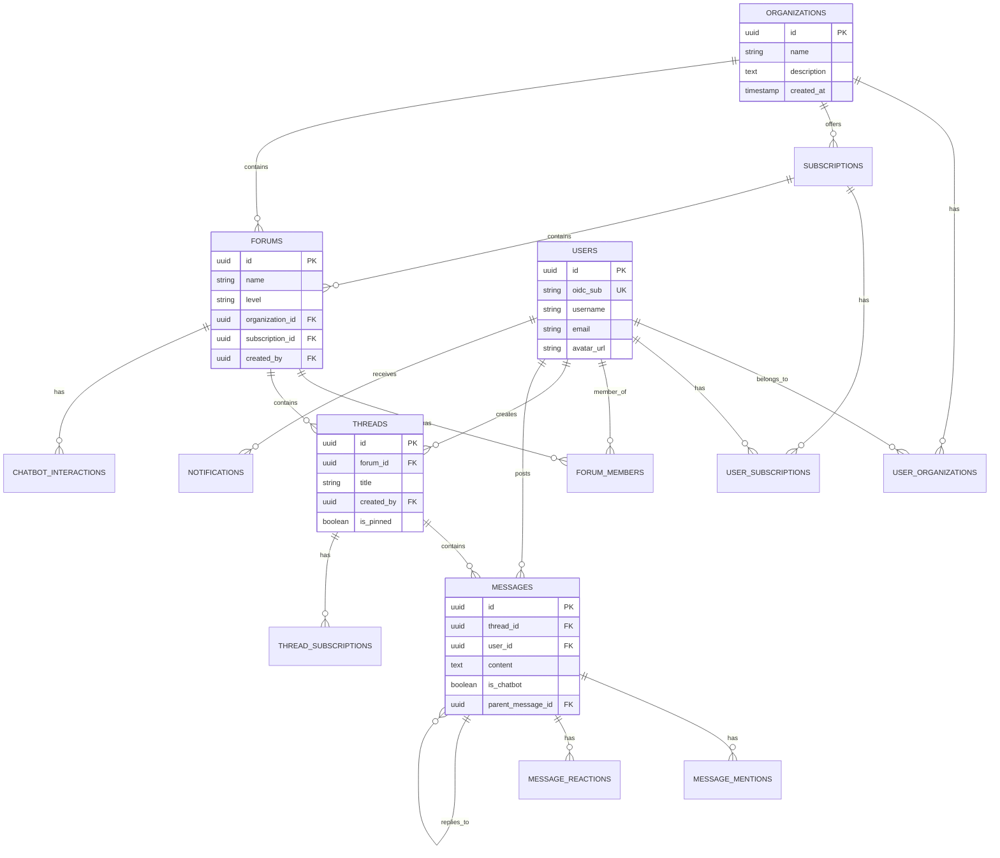

# Forums Component Design Document

## Overview

The Forums Component is a comprehensive discussion platform integrated into the Nirdesh UI application. It provides three hierarchical forum levels (Organization, Subscription, Private Channel) with embedded chatbot assistance. The design follows a micro-frontend architecture pattern, ensuring modularity, scalability, and maintainability while integrating seamlessly with the existing Nirdesh UI built on React, Material-UI, and OIDC authentication.

## Architecture

### High-Level Architecture



### Frontend Micro-Architecture

The forums component follows a modular micro-frontend architecture with clear separation of concerns:



### Component Hierarchy

```
src/
├── components/
│   ├── forums/                          # Forums module root
│   │   ├── ForumShell.jsx              # Main container component
│   │   ├── ForumList/
│   │   │   ├── ForumList.jsx           # Forum listing container
│   │   │   ├── ForumCard.jsx           # Individual forum card
│   │   │   ├── ForumFilter.jsx         # Filter by level/type
│   │   │   └── CreateForumDialog.jsx   # Create new forum modal
│   │   ├── ThreadView/
│   │   │   ├── ThreadView.jsx          # Thread container
│   │   │   ├── ThreadList.jsx          # List of threads
│   │   │   ├── ThreadCard.jsx          # Individual thread preview
│   │   │   ├── ThreadDetail.jsx        # Full thread view
│   │   │   └── CreateThreadDialog.jsx  # Create thread modal
│   │   ├── Message/
│   │   │   ├── MessageList.jsx         # Message feed
│   │   │   ├── MessageBubble.jsx       # Individual message
│   │   │   ├── MessageComposer.jsx     # Message input
│   │   │   └── MessageActions.jsx      # Edit/delete/react
│   │   ├── Chatbot/
│   │   │   ├── ChatbotWidget.jsx       # Chatbot UI
│   │   │   ├── ChatbotTrigger.jsx      # Mention/invoke button
│   │   │   └── ChatbotMessage.jsx      # Chatbot response styling
│   │   ├── Search/
│   │   │   ├── SearchBar.jsx           # Search input
│   │   │   ├── SearchResults.jsx       # Results display
│   │   │   └── SearchFilters.jsx       # Filter options
│   │   ├── Notifications/
│   │   │   ├── NotificationBell.jsx    # Notification icon
│   │   │   ├── NotificationPanel.jsx   # Notification dropdown
│   │   │   └── NotificationItem.jsx    # Individual notification
│   │   └── shared/
│   │       ├── ForumBreadcrumb.jsx     # Navigation breadcrumb
│   │       ├── UserAvatar.jsx          # User profile picture
│   │       ├── RoleBadge.jsx           # Role indicator
│   │       └── LoadingSpinner.jsx      # Loading state
│   └── [existing components...]
├── services/
│   ├── forumAPI.js                      # REST API calls
│   ├── websocketService.js              # WebSocket connection
│   └── chatbotService.js                # Chatbot API integration
├── contexts/
│   ├── ForumContext.jsx                 # Forum state management
│   └── NotificationContext.jsx          # Notification state
├── hooks/
│   ├── useForum.js                      # Forum data hook
│   ├── useThread.js                     # Thread data hook
│   ├── useMessages.js                   # Message management
│   ├── useWebSocket.js                  # WebSocket connection
│   └── useChatbot.js                    # Chatbot interaction
└── styles/
    └── forums/
        ├── forum.css                    # Forum-specific styles
        ├── thread.css                   # Thread styles
        └── message.css                  # Message styles
```

## Components and Interfaces

### Core Components

#### 1. ForumShell Component
Main container that manages routing and layout for the forums module.

**Props:**
- `userId`: string - Current authenticated user ID
- `userRoles`: array - User's roles across organizations

**State:**
- `currentForum`: object - Currently selected forum
- `notifications`: array - User notifications
- `unreadCount`: number - Unread notification count

**Key Methods:**
- `navigateToForum(forumId)` - Navigate to specific forum
- `handleNotificationClick(notificationId)` - Handle notification interaction

#### 2. ForumList Component
Displays forums organized by hierarchy level with filtering capabilities.

**Props:**
- `level`: string - 'organization' | 'subscription' | 'private'
- `userId`: string - Current user ID
- `onForumSelect`: function - Callback when forum is selected

**State:**
- `forums`: array - List of accessible forums
- `filter`: object - Current filter settings
- `loading`: boolean - Loading state

#### 3. ThreadView Component
Manages thread display and message interactions within a forum.

**Props:**
- `forumId`: string - Current forum ID
- `threadId`: string - Current thread ID (optional)
- `userId`: string - Current user ID

**State:**
- `threads`: array - List of threads
- `messages`: array - Messages in current thread
- `realtimeConnected`: boolean - WebSocket connection status

#### 4. ChatbotWidget Component
Embedded chatbot interface for each forum channel.

**Props:**
- `forumId`: string - Associated forum ID
- `threadId`: string - Associated thread ID
- `context`: object - Forum context for chatbot

**State:**
- `chatbotActive`: boolean - Chatbot visibility
- `chatHistory`: array - Conversation history
- `isTyping`: boolean - Chatbot typing indicator

### API Interfaces

#### REST API Endpoints

```javascript
// Forum Management
GET    /api/forums                          // List accessible forums
GET    /api/forums/:id                      // Get forum details
POST   /api/forums                          // Create new forum
PUT    /api/forums/:id                      // Update forum
DELETE /api/forums/:id                      // Delete forum

// Thread Management
GET    /api/forums/:forumId/threads         // List threads in forum
GET    /api/threads/:id                     // Get thread details
POST   /api/forums/:forumId/threads         // Create new thread
PUT    /api/threads/:id                     // Update thread
DELETE /api/threads/:id                     // Delete thread

// Message Management
GET    /api/threads/:threadId/messages      // Get messages in thread
POST   /api/threads/:threadId/messages      // Post new message
PUT    /api/messages/:id                    // Edit message
DELETE /api/messages/:id                    // Delete message

// Chatbot Integration
POST   /api/chatbot/query                   // Send query to chatbot
GET    /api/chatbot/history/:threadId       // Get chatbot history

// Access Control
GET    /api/forums/:forumId/members         // List forum members
POST   /api/forums/:forumId/members         // Add member
DELETE /api/forums/:forumId/members/:userId // Remove member
PUT    /api/forums/:forumId/members/:userId/role // Update member role

// Search
GET    /api/search?q=:query&level=:level    // Search forums/threads/messages

// Notifications
GET    /api/notifications                   // Get user notifications
PUT    /api/notifications/:id/read          // Mark as read
DELETE /api/notifications/:id               // Delete notification
```

#### WebSocket Events

```javascript
// Client -> Server
{
  type: 'subscribe_thread',
  threadId: 'thread-123'
}

{
  type: 'send_message',
  threadId: 'thread-123',
  content: 'Message text',
  mentions: ['@user1', '@chatbot']
}

{
  type: 'typing_indicator',
  threadId: 'thread-123',
  isTyping: true
}

// Server -> Client
{
  type: 'new_message',
  threadId: 'thread-123',
  message: { id, userId, content, timestamp }
}

{
  type: 'user_typing',
  threadId: 'thread-123',
  userId: 'user-456',
  username: 'John Doe'
}

{
  type: 'notification',
  notification: { id, type, content, timestamp }
}

{
  type: 'chatbot_response',
  threadId: 'thread-123',
  message: { id, content, timestamp }
}
```

## Data Models

### Database Schema

```sql
-- Organizations Table
CREATE TABLE organizations (
    id UUID PRIMARY KEY DEFAULT gen_random_uuid(),
    name VARCHAR(255) NOT NULL,
    description TEXT,
    created_at TIMESTAMP DEFAULT CURRENT_TIMESTAMP,
    updated_at TIMESTAMP DEFAULT CURRENT_TIMESTAMP
);

-- Subscriptions Table
CREATE TABLE subscriptions (
    id UUID PRIMARY KEY DEFAULT gen_random_uuid(),
    name VARCHAR(255) NOT NULL,
    tier VARCHAR(50) NOT NULL, -- 'basic', 'premium', 'enterprise'
    organization_id UUID REFERENCES organizations(id) ON DELETE CASCADE,
    created_at TIMESTAMP DEFAULT CURRENT_TIMESTAMP,
    expires_at TIMESTAMP
);

-- Users Table (extends existing OIDC user data)
CREATE TABLE users (
    id UUID PRIMARY KEY DEFAULT gen_random_uuid(),
    oidc_sub VARCHAR(255) UNIQUE NOT NULL, -- OIDC subject identifier
    username VARCHAR(100) NOT NULL,
    email VARCHAR(255) NOT NULL,
    avatar_url VARCHAR(500),
    created_at TIMESTAMP DEFAULT CURRENT_TIMESTAMP,
    last_active TIMESTAMP DEFAULT CURRENT_TIMESTAMP
);

-- User Organization Membership
CREATE TABLE user_organizations (
    user_id UUID REFERENCES users(id) ON DELETE CASCADE,
    organization_id UUID REFERENCES organizations(id) ON DELETE CASCADE,
    role VARCHAR(50) NOT NULL, -- 'admin', 'moderator', 'member', 'guest'
    joined_at TIMESTAMP DEFAULT CURRENT_TIMESTAMP,
    PRIMARY KEY (user_id, organization_id)
);

-- User Subscriptions
CREATE TABLE user_subscriptions (
    user_id UUID REFERENCES users(id) ON DELETE CASCADE,
    subscription_id UUID REFERENCES subscriptions(id) ON DELETE CASCADE,
    status VARCHAR(50) NOT NULL, -- 'active', 'expired', 'cancelled'
    subscribed_at TIMESTAMP DEFAULT CURRENT_TIMESTAMP,
    PRIMARY KEY (user_id, subscription_id)
);

-- Forums Table (supports all three levels)
CREATE TABLE forums (
    id UUID PRIMARY KEY DEFAULT gen_random_uuid(),
    name VARCHAR(255) NOT NULL,
    description TEXT,
    level VARCHAR(50) NOT NULL, -- 'organization', 'subscription', 'private'
    organization_id UUID REFERENCES organizations(id) ON DELETE CASCADE,
    subscription_id UUID REFERENCES subscriptions(id) ON DELETE SET NULL,
    created_by UUID REFERENCES users(id) ON DELETE SET NULL,
    created_at TIMESTAMP DEFAULT CURRENT_TIMESTAMP,
    updated_at TIMESTAMP DEFAULT CURRENT_TIMESTAMP,
    is_archived BOOLEAN DEFAULT FALSE,
    
    -- Constraints to ensure proper hierarchy
    CONSTRAINT check_forum_level CHECK (
        (level = 'organization' AND organization_id IS NOT NULL AND subscription_id IS NULL) OR
        (level = 'subscription' AND subscription_id IS NOT NULL) OR
        (level = 'private' AND organization_id IS NOT NULL)
    )
);

-- Forum Members (for private channels and explicit membership)
CREATE TABLE forum_members (
    forum_id UUID REFERENCES forums(id) ON DELETE CASCADE,
    user_id UUID REFERENCES users(id) ON DELETE CASCADE,
    role VARCHAR(50) NOT NULL, -- 'admin', 'moderator', 'member'
    joined_at TIMESTAMP DEFAULT CURRENT_TIMESTAMP,
    invited_by UUID REFERENCES users(id) ON DELETE SET NULL,
    PRIMARY KEY (forum_id, user_id)
);

-- Threads Table
CREATE TABLE threads (
    id UUID PRIMARY KEY DEFAULT gen_random_uuid(),
    forum_id UUID REFERENCES forums(id) ON DELETE CASCADE,
    title VARCHAR(500) NOT NULL,
    created_by UUID REFERENCES users(id) ON DELETE SET NULL,
    created_at TIMESTAMP DEFAULT CURRENT_TIMESTAMP,
    updated_at TIMESTAMP DEFAULT CURRENT_TIMESTAMP,
    is_pinned BOOLEAN DEFAULT FALSE,
    is_locked BOOLEAN DEFAULT FALSE,
    view_count INTEGER DEFAULT 0,
    message_count INTEGER DEFAULT 0
);

-- Messages Table
CREATE TABLE messages (
    id UUID PRIMARY KEY DEFAULT gen_random_uuid(),
    thread_id UUID REFERENCES threads(id) ON DELETE CASCADE,
    user_id UUID REFERENCES users(id) ON DELETE SET NULL,
    content TEXT NOT NULL,
    is_chatbot BOOLEAN DEFAULT FALSE,
    parent_message_id UUID REFERENCES messages(id) ON DELETE SET NULL,
    created_at TIMESTAMP DEFAULT CURRENT_TIMESTAMP,
    updated_at TIMESTAMP DEFAULT CURRENT_TIMESTAMP,
    is_edited BOOLEAN DEFAULT FALSE,
    is_deleted BOOLEAN DEFAULT FALSE
);

-- Message Mentions
CREATE TABLE message_mentions (
    message_id UUID REFERENCES messages(id) ON DELETE CASCADE,
    mentioned_user_id UUID REFERENCES users(id) ON DELETE CASCADE,
    is_read BOOLEAN DEFAULT FALSE,
    PRIMARY KEY (message_id, mentioned_user_id)
);

-- Message Reactions
CREATE TABLE message_reactions (
    message_id UUID REFERENCES messages(id) ON DELETE CASCADE,
    user_id UUID REFERENCES users(id) ON DELETE CASCADE,
    reaction_type VARCHAR(50) NOT NULL, -- 'like', 'love', 'helpful', etc.
    created_at TIMESTAMP DEFAULT CURRENT_TIMESTAMP,
    PRIMARY KEY (message_id, user_id, reaction_type)
);

-- Chatbot Interactions
CREATE TABLE chatbot_interactions (
    id UUID PRIMARY KEY DEFAULT gen_random_uuid(),
    forum_id UUID REFERENCES forums(id) ON DELETE CASCADE,
    thread_id UUID REFERENCES threads(id) ON DELETE CASCADE,
    user_id UUID REFERENCES users(id) ON DELETE SET NULL,
    query TEXT NOT NULL,
    response TEXT NOT NULL,
    confidence_score DECIMAL(3,2),
    created_at TIMESTAMP DEFAULT CURRENT_TIMESTAMP
);

-- Notifications Table
CREATE TABLE notifications (
    id UUID PRIMARY KEY DEFAULT gen_random_uuid(),
    user_id UUID REFERENCES users(id) ON DELETE CASCADE,
    type VARCHAR(50) NOT NULL, -- 'mention', 'reply', 'invite', 'chatbot_response'
    title VARCHAR(255) NOT NULL,
    content TEXT,
    related_forum_id UUID REFERENCES forums(id) ON DELETE CASCADE,
    related_thread_id UUID REFERENCES threads(id) ON DELETE CASCADE,
    related_message_id UUID REFERENCES messages(id) ON DELETE CASCADE,
    is_read BOOLEAN DEFAULT FALSE,
    created_at TIMESTAMP DEFAULT CURRENT_TIMESTAMP
);

-- Thread Subscriptions (for notification preferences)
CREATE TABLE thread_subscriptions (
    thread_id UUID REFERENCES threads(id) ON DELETE CASCADE,
    user_id UUID REFERENCES users(id) ON DELETE CASCADE,
    notify_on_reply BOOLEAN DEFAULT TRUE,
    notify_on_mention BOOLEAN DEFAULT TRUE,
    subscribed_at TIMESTAMP DEFAULT CURRENT_TIMESTAMP,
    PRIMARY KEY (thread_id, user_id)
);

-- Indexes for performance
CREATE INDEX idx_forums_level ON forums(level);
CREATE INDEX idx_forums_org ON forums(organization_id);
CREATE INDEX idx_forums_subscription ON forums(subscription_id);
CREATE INDEX idx_threads_forum ON threads(forum_id);
CREATE INDEX idx_threads_updated ON threads(updated_at DESC);
CREATE INDEX idx_messages_thread ON messages(thread_id);
CREATE INDEX idx_messages_created ON messages(created_at DESC);
CREATE INDEX idx_notifications_user_unread ON notifications(user_id, is_read);
CREATE INDEX idx_user_orgs ON user_organizations(user_id);
CREATE INDEX idx_forum_members ON forum_members(forum_id, user_id);

-- Full-text search indexes
CREATE INDEX idx_threads_title_fts ON threads USING GIN(to_tsvector('english', title));
CREATE INDEX idx_messages_content_fts ON messages USING GIN(to_tsvector('english', content));
```

### Entity Relationship Diagram



## Error Handling

### Frontend Error Handling Strategy

```javascript
// Error boundary for forums module
class ForumErrorBoundary extends React.Component {
  state = { hasError: false, error: null };
  
  static getDerivedStateFromError(error) {
    return { hasError: true, error };
  }
  
  componentDidCatch(error, errorInfo) {
    console.error('Forum Error:', error, errorInfo);
    // Log to error tracking service
  }
  
  render() {
    if (this.state.hasError) {
      return <ErrorFallback error={this.state.error} />;
    }
    return this.props.children;
  }
}

// API error handling
const handleAPIError = (error) => {
  if (error.response) {
    switch (error.response.status) {
      case 401:
        // Redirect to login
        return { type: 'AUTH_ERROR', message: 'Please log in again' };
      case 403:
        return { type: 'PERMISSION_ERROR', message: 'Access denied' };
      case 404:
        return { type: 'NOT_FOUND', message: 'Resource not found' };
      case 429:
        return { type: 'RATE_LIMIT', message: 'Too many requests' };
      case 500:
        return { type: 'SERVER_ERROR', message: 'Server error occurred' };
      default:
        return { type: 'UNKNOWN_ERROR', message: 'An error occurred' };
    }
  }
  return { type: 'NETWORK_ERROR', message: 'Network connection failed' };
};

// WebSocket error handling
const handleWebSocketError = (error) => {
  console.error('WebSocket error:', error);
  // Attempt reconnection with exponential backoff
  reconnectWebSocket();
};
```

### Backend Error Responses

```javascript
// Standard error response format
{
  "error": {
    "code": "FORUM_NOT_FOUND",
    "message": "The requested forum does not exist",
    "details": {
      "forumId": "forum-123"
    },
    "timestamp": "2026-03-01T10:30:00Z"
  }
}

// Error codes
const ERROR_CODES = {
  // Authentication & Authorization
  AUTH_REQUIRED: 'Authentication required',
  INVALID_TOKEN: 'Invalid authentication token',
  PERMISSION_DENIED: 'Insufficient permissions',
  
  // Resource errors
  FORUM_NOT_FOUND: 'Forum not found',
  THREAD_NOT_FOUND: 'Thread not found',
  MESSAGE_NOT_FOUND: 'Message not found',
  
  // Validation errors
  INVALID_INPUT: 'Invalid input data',
  MISSING_REQUIRED_FIELD: 'Required field missing',
  
  // Business logic errors
  SUBSCRIPTION_EXPIRED: 'Subscription has expired',
  FORUM_ARCHIVED: 'Forum is archived',
  THREAD_LOCKED: 'Thread is locked',
  
  // Rate limiting
  RATE_LIMIT_EXCEEDED: 'Rate limit exceeded',
  
  // Chatbot errors
  CHATBOT_UNAVAILABLE: 'Chatbot service unavailable',
  CHATBOT_TIMEOUT: 'Chatbot response timeout'
};
```

## Testing Strategy

### Unit Testing

**Frontend Components:**
- Test each component in isolation using React Testing Library
- Mock API calls and WebSocket connections
- Test user interactions and state changes
- Verify accessibility compliance

```javascript
// Example: ForumCard.test.jsx
describe('ForumCard', () => {
  it('renders forum name and description', () => {
    const forum = { id: '1', name: 'Test Forum', description: 'Test' };
    render(<ForumCard forum={forum} />);
    expect(screen.getByText('Test Forum')).toBeInTheDocument();
  });
  
  it('calls onSelect when clicked', () => {
    const onSelect = jest.fn();
    const forum = { id: '1', name: 'Test Forum' };
    render(<ForumCard forum={forum} onSelect={onSelect} />);
    fireEvent.click(screen.getByRole('button'));
    expect(onSelect).toHaveBeenCalledWith('1');
  });
});
```

**Backend Services:**
- Test service methods with mocked database calls
- Verify access control logic
- Test chatbot integration
- Validate error handling

### Integration Testing

- Test API endpoints with real database (test environment)
- Verify WebSocket message flow
- Test authentication and authorization flows
- Validate database transactions and rollbacks

### End-to-End Testing

- Use Cypress or Playwright for E2E tests
- Test complete user workflows:
  - Creating a forum and posting messages
  - Chatbot interaction
  - Real-time message updates
  - Notification delivery
  - Search functionality

```javascript
// Example: E2E test
describe('Forum Creation Flow', () => {
  it('allows user to create organization forum', () => {
    cy.login('testuser@example.com');
    cy.visit('/forums');
    cy.contains('Create Forum').click();
    cy.get('[name="forumName"]').type('Engineering Discussions');
    cy.get('[name="level"]').select('organization');
    cy.contains('Create').click();
    cy.contains('Engineering Discussions').should('be.visible');
  });
});
```

### Performance Testing

- Load testing for concurrent users
- WebSocket connection stress testing
- Database query performance benchmarking
- Chatbot response time monitoring

### Accessibility Testing

- Keyboard navigation testing
- Screen reader compatibility
- Color contrast validation
- ARIA attributes verification

## Integration with Existing Nirdesh UI

### Routing Integration

Add forum routes to existing `App.jsx`:

```javascript
<Route path="/forums" element={<ForumShell />} />
<Route path="/forums/:forumId" element={<ForumShell />} />
<Route path="/forums/:forumId/threads/:threadId" element={<ForumShell />} />
```

### Navigation Integration

Add forums link to `VerticalMenuBar.jsx`:

```javascript
<MenuItem icon={<ForumIcon />} label="Forums" path="/forums" />
```

### Authentication Integration

Leverage existing OIDC authentication from `react-oidc-context`:

```javascript
const ForumShell = () => {
  const auth = useAuth();
  
  useEffect(() => {
    if (auth.isAuthenticated) {
      // Initialize forum context with user data
      initializeForumContext(auth.user);
    }
  }, [auth.isAuthenticated]);
  
  // Component logic
};
```

### Styling Integration

Extend existing Material-UI theme and custom CSS:

```javascript
// Use existing MUI components
import { Card, Typography, Button } from '@mui/material';

// Import existing global styles
import '../styles/global.css';

// Add forum-specific styles
import '../styles/forums/forum.css';
```

## Scalability Considerations

### Frontend Optimization

- Implement virtual scrolling for long message lists
- Lazy load forum components
- Use React.memo for expensive components
- Implement pagination for threads and messages
- Cache forum data in localStorage

### Backend Optimization

- Implement database connection pooling
- Use Redis for caching frequently accessed data
- Implement message queue for notifications
- Use CDN for static assets
- Implement database read replicas for scaling reads

### WebSocket Scaling

- Use Redis pub/sub for multi-server WebSocket synchronization
- Implement sticky sessions for WebSocket connections
- Monitor connection limits and implement backpressure

## Security Considerations

- Validate all user inputs on both frontend and backend
- Implement rate limiting on API endpoints
- Sanitize message content to prevent XSS attacks
- Use parameterized queries to prevent SQL injection
- Implement CSRF protection
- Encrypt sensitive data at rest
- Use HTTPS for all communications
- Implement proper CORS policies
- Audit access control logic regularly
- Log security-relevant events

## Deployment Strategy

### Development Environment
- Local PostgreSQL database
- Mock chatbot service
- WebSocket server on localhost

### Staging Environment
- Cloud-hosted database (AWS RDS / Azure Database)
- Staging chatbot API
- Load balancer for WebSocket servers

### Production Environment
- Multi-region database with replication
- Production chatbot service with SLA
- Auto-scaling WebSocket servers
- CDN for static assets
- Monitoring and alerting (Datadog, New Relic)
- Backup and disaster recovery procedures
